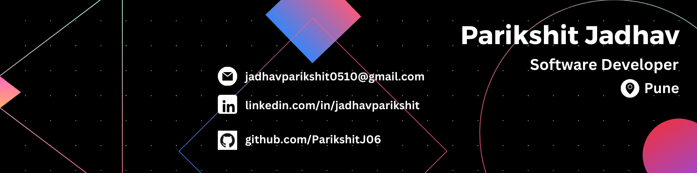

## Hi there 👋

<h1 align="center">Hey Hi 👋, I am Parikshit Jadhav</h1>
<h3 align="center">| Aspiring Software Engineer | Full-Stack Web Developer | AI & ML Enthusiast |</h3>

  
  

  

  

  

  

---

### 🔭 What I’m Working On:
- **Web Development:** Building dynamic and responsive web applications with a focus on performance and user experience.
- **Generative AI Projects:** Exploring the applications of AI in creative solutions and automation.

### 🌱 What I’m Learning:
- **DevOps:** Enhancing my skills in CI/CD, Docker, Kubernetes, and cloud deployment.
- **Java Full Stack Development:** Mastering the development of scalable web applications using Java, Spring Boot, and associated technologies.
- **Generative AI:** Continuing to explore AI tools and models like GPT and DALL-E for innovative solutions.

---

### 📫 How to Reach Me:
- **Email:** [jadhavparikshit0510@gmail.com](mailto:jadhavparikshit0510@gmail.com)
- **LinkedIn:** [linkedin.com/in/jadhavparikshit](https://in.linkedin.com/in/jadhavparikshit)
- **Twitter:** [@jparikshit6](https://x.com/jparikshit0510)

---

### 🚀 Connect with Me:

  
  
  
  

---

### 🛠️ Languages and Tools:

  
  
  
  
  
  
  
  
  
  
  

---

